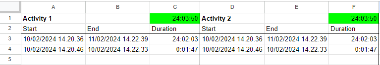

# Setup the App
The app is hosted at [work-time.theodorrisager.dk](https://work-time.theodorrisager.dk/).
In order to use it you have to setup a Google Sheet and a Google Apps Script, instructions for which are found below.

## Setup Google Sheets 
 1. Create a Google Sheet in Google Drive 
 2. Paste the following into the 'A1' cell
    - Copy the 3rd row as many times as you want 
        - If you e.g. copy it 100 times, then you are able to insert 100 entries into each comlum
    - Replace `Activity 1` and `Activity 2` with names that fit your activities
    - If you want more activities, just add something to the upper left cell of each activity column e.g. 'G1'
``` 
Activity 1		=sum(C3:C)	Activity 2		=sum(F3:F)			=sum(I3:I)			=sum(L3:L)			=sum(O3:O)			=sum(R3:R)			=sum(U3:U)			=sum(X3:X)			=sum(AA3:AA)
Start	End	Duration	Start	End	Duration	Start	End	Duration	Start	End	Duration	Start	End	Duration	Start	End	Duration	Start	End	Duration	Start	End	Duration	Start	End	Duration
		=IF(OR(ISBLANK(A3),ISBLANK(B3)),,B3-A3)			=IF(OR(ISBLANK(D3),ISBLANK(E3)),,E3-D3)			=IF(OR(ISBLANK(G3),ISBLANK(H3)),,H3-G3)			=IF(OR(ISBLANK(J3),ISBLANK(K3)),,K3-J3)			=IF(OR(ISBLANK(M3),ISBLANK(N3)),,N3-M3)			=IF(OR(ISBLANK(P3),ISBLANK(Q3)),,Q3-P3)			=IF(OR(ISBLANK(S3),ISBLANK(T3)),,T3-S3)			=IF(OR(ISBLANK(V3),ISBLANK(W3)),,W3-V3)			=IF(OR(ISBLANK(Y3),ISBLANK(Z3)),,Z3-Y3)
``` 
 3. Copy the `SheetId` for use in the Google Apps Script
    - You find this in the url `https://docs.google.com/spreadsheets/d/<SheetId>/edit#gid=0`
 4. Format the sheet, I have done it as shown on the image below
    - To be able to show the duration as a duration and not just a number, make sure to format the cell as `Duration`



## Google Apps Script
 1. Create Google Apps Script in Google Drive
    - Press `New` (Upper left corner)
    - Press `More`
    - Press `Google Apps Script`
 2. Enter a name for the Apps Script e.g. `Work Time Script`
 3. Change the name of the Sheet from e.g. `Sheet1` to `Data`
 4. Copy the contents of `google_apps_scripts/Code.gs` into the `Code.gs` file in Google Apps Script
 5. Setup `sheetId` property
    - Navigate to `Project Settings`
    - Press `Add script property`
    - Enter `sheetId` into `Property`
    - Enter the `SheetId` you copied in step 3 while setting up the Google Sheets into `Value`
    - Press `Save script properties`
 6. Deploy Apps Script
    - Press `Deploy`
    - Press `New Deployment`
    - Press `Select type` (Small gear, upper left)
    - Press `Web app`
    - Enter `Initial Deployment` into `Description`
    - In `Who has access` select `Anyone`
        - This is needed as the app does not handle authentication
    - Press `Deploy`
    - Press `Authorize access`
        - Login with your Google Account 
        - Press `Advanced`
        - Press `Go to Work Time Script (unsafe)`
        - Press `Allow`
    - Copy the `URL`
        - This URL is used when you first open the app

<div align="center">  
      
    <h1> Vite template for Codux</h1>
</div>

### A Visual IDE for React Projects

Codux is an all-in-one visual development environment. Whether you’re starting a new app, creating components, or editing an existing project, every visual change you make reflects instantly in the code and vice versa. To learn more about Codux, visit our website - [https://www.codux.com/](https://www.codux.com/)

This project was bootstrapped with [`Vite`](https://vitejs.dev).

It includes a single React component to start your project with, a sample [`codux.config.json`](codux.config.json) with preconfigured keys, a `package.json` file to describe the project's packages and dependencies, and a folder and component structure to put everything neatly in its place.

- Edit, render and compose apps that make use of **`React`**-based components.
- Create components with **`TypeScript`**, **`SCSS`** and **`CSS Modules`** support.
- Visually edit in real-time and in an isolated environment.

### Available Scripts

In the project directory, you can run:

### `npm run build`

Build the application in production mode into a folder named `dist`. This folder can be served using any HTTP server.

### `npm run dev`

Start dev server, aliases: `vite dev`, `vite serve`.\
Open [http://127.0.0.1:5173/](http://127.0.0.1:5173/) to view it in the browser.

### `npm run preview`

Boots up a local static web server that serves the files from dist at [`http://localhost:4173`](http://localhost:4173) . It's an easy way to check if the production build looks OK in your local environment.
